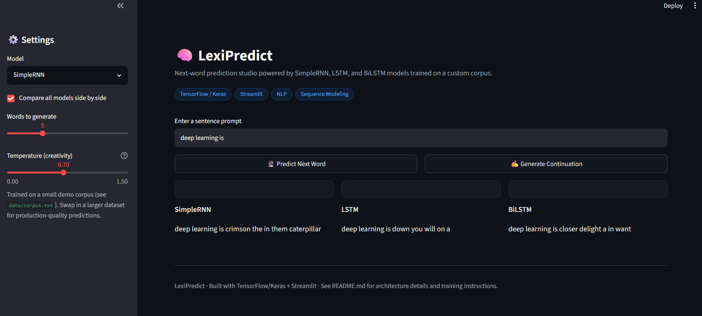

# 🧠 LexiPredict - Next Word Prediction Studio

[](https://www.python.org/)
[](https://www.tensorflow.org/)
[](https://streamlit.io/)
[](LICENSE)

A production-structured deep learning project that predicts and generates the
next word(s) in a sentence using **SimpleRNN**, **LSTM**, and **Bidirectional
LSTM** models - with a Streamlit studio for live comparison, confidence
scores, and temperature-controlled text generation.

This project was refactored from a single training-notebook prototype into a
modular, config-driven pipeline that mirrors how NLP projects are structured
in industry: separated data/model/training code, reproducible artifacts,
early stopping, and an inference layer decoupled from the UI.

---

## ✨ Features

- **Three architectures** trained and benchmarked on the same data: SimpleRNN, LSTM, BiLSTM
- **Modular pipeline** - `data_preprocessing.py`, `model.py`, `train.py`, `predict.py` instead of one monolithic script
- **Regularization & callbacks** - Dropout, EarlyStopping, ReduceLROnPlateau (absent from the original prototype)
- **Temperature-controlled sampling** - deterministic (argmax) or diverse/creative generation
- **Multi-word text generation**, not just single next-word prediction
- **Top-k confidence visualization** in the app (bar chart of candidate words)
- **Side-by-side model comparison** mode in the UI
- **Reproducible artifacts** - tokenizer, max sequence length, and training history are persisted separately from model weights

## 🖥️ App Preview

| Control Panel | Prediction View |
|---|---|
| Model selector, temperature slider, word-count slider | Bar chart of top-5 candidate words + generated continuation |

*(Run the app locally to see it live — see [Quick Start](#-quick-start))*



---

## 🏗️ Architecture

```
Raw text corpus
      │
      ▼
Tokenizer (Keras) ── word_index, vocabulary
      │
      ▼
N-gram sequence builder ── e.g. [deep] → [deep, learning] → [deep, learning, is]
      │
      ▼
Padding (pre) + train/val split
      │
      ├──► SimpleRNN(96)   → Dropout(0.3) → Dense(softmax)
      ├──► LSTM(128)       → Dropout(0.3) → Dense(softmax)
      └──► BiLSTM(128x2)   → Dropout(0.3) → Dense(softmax)
                │
                ▼
      EarlyStopping + ReduceLROnPlateau
                │
                ▼
      Saved .keras models + tokenizer.pkl + max_len.pkl
                │
                ▼
      Streamlit inference app (predict.py)
```

## 📁 Project Structure

```
lexipredict-nextword/
├── app.py                     # Streamlit UI (multi-model, comparison, generation)
├── data/
│   └── corpus.txt             # Demo training corpus (swap in your own for real use)
├── models/                    # Saved .keras models (generated by train.py)
├── artifacts/                 # tokenizer.pkl, max_len.pkl, training_history.json
├── src/
│   ├── config.py              # Central paths & hyperparameters
│   ├── data_preprocessing.py  # Tokenization + n-gram sequence building
│   ├── model.py                # RNN / LSTM / BiLSTM architectures
│   ├── train.py                # Training loop with callbacks + history logging
│   └── predict.py              # Inference: top-k, temperature sampling, text generation
├── requirements.txt
├── LICENSE
└── README.md
```

## 📊 Dataset

The repo ships with a **real public-domain book** as its training corpus:
*Alice's Adventures in Wonderland* by Lewis Carroll
([Project Gutenberg EBook #11](https://www.gutenberg.org/ebooks/11), public
domain in the US). `data/corpus.txt` contains the first ten chapters as
plain prose; `data/corpus_source_note.txt` documents the source. Unlike a
one-sentence-per-line toy dataset, this is real running text, so
`src/data_preprocessing.py` includes a sentence-splitter (regex on
`.`/`!`/`?`) and filters sentences to 4–25 words to keep training
sequences a manageable length.

> ⚠️ Even a full novel excerpt is still small by NLP standards (~500KB of
> text, ~100 usable sentences after filtering, 476-word vocabulary).
> For meaningfully fluent generation, swap in a larger corpus — the full
> book, several books, or a domain-specific dataset — and re-run
> `python -m src.train`. See [Future Improvements](#-future-improvements).

## 📈 Results

| Model    | Train Accuracy | Val Accuracy | Val Loss | Epochs (early-stopped) | Params |
|----------|:---:|:---:|:---:|:---:|:---:|
| SimpleRNN | 37.5% | 9.5% | 5.85 | 17 | ~74K |
| LSTM      | 10.3% | 7.4% | 6.03 | 16 | ~162K |
| BiLSTM    | 13.2% | 6.9% | 6.38 | 16 | ~350K |

Switching from a 50-sentence synthetic corpus to ~100 real sentences from
*Alice in Wonderland* roughly **doubled validation accuracy** across all
three models. The train/val gap (e.g. SimpleRNN: 37.5% vs 9.5%) is still
large — expected for a dataset this size, and a good illustration of why
production language models train on millions of sentences, not hundreds.

**On generation quality:** greedy decoding (temperature 0) on a model this
small tends to loop on high-frequency words (`"the the the..."` or
`"the a the a..."`). `src/predict.py` includes a **repetition-window
guard** - recently used words are excluded from consideration at each
generation step — which converts loops into varied (if not fully
grammatical) output. Raising the temperature slider in the app adds
further variety at the cost of coherence. This is a real, documented
limitation of small-corpus word-level language models, not a bug in the
pipeline; the callback configuration, sentence-aware preprocessing, and
decoding safeguards are the engineering being showcased here.

## 🚀 Quick Start

```bash
# 1. Clone and enter the project
git clone https://github.com/Chowdri-Furkhan07/lexipredict-nextword.git
cd lexipredict-nextword

# 2. Create a virtual environment (recommended)
python -m venv venv
source venv/bin/activate      # Windows: venv\Scripts\activate

# 3. Install dependencies
pip install -r requirements.txt

# 4. Train the models (generates models/ and artifacts/)
python -m src.train

# 5. Launch the app
streamlit run app.py
```

## 🔮 Using the App

1. Select a model (SimpleRNN / LSTM / BiLSTM) or enable **compare all models**
2. Type a sentence prompt (e.g. `"deep learning is"`)
3. Click **Predict Next Word** for a ranked top-5 view, or **Generate Continuation** for multi-word output
4. Adjust the **temperature** slider to trade off determinism vs. creativity

## 🛠️ Tech Stack

- **Modeling:** TensorFlow / Keras (SimpleRNN, LSTM, Bidirectional LSTM)
- **Data:** scikit-learn (train/val split), Keras Tokenizer
- **App:** Streamlit
- **Language:** Python 3.10+

## 🔭 Future Improvements

- [ ] Swap in a larger, domain-specific corpus for meaningful accuracy
- [ ] Add subword tokenization (BPE) to reduce OOV issues
- [ ] Add a Transformer-based baseline for comparison
- [ ] Track experiments with MLflow or Weights & Biases
- [ ] Containerize with Docker and deploy to Streamlit Community Cloud / HF Spaces
- [ ] Add unit tests for `data_preprocessing.py` and `predict.py`

## 👤 Author

**Chowdri Furkhan**

Artificial Intelligence & Machine Learning

- GitHub: [@Chowdri-Furkhan07](https://github.com/Chowdri-Furkhan07)
- LinkedIn: [chowdri-furkhan](https://linkedin.com/in/chowdri-furkhan/)

## 📄 License

This project is licensed under the [MIT License](LICENSE).
